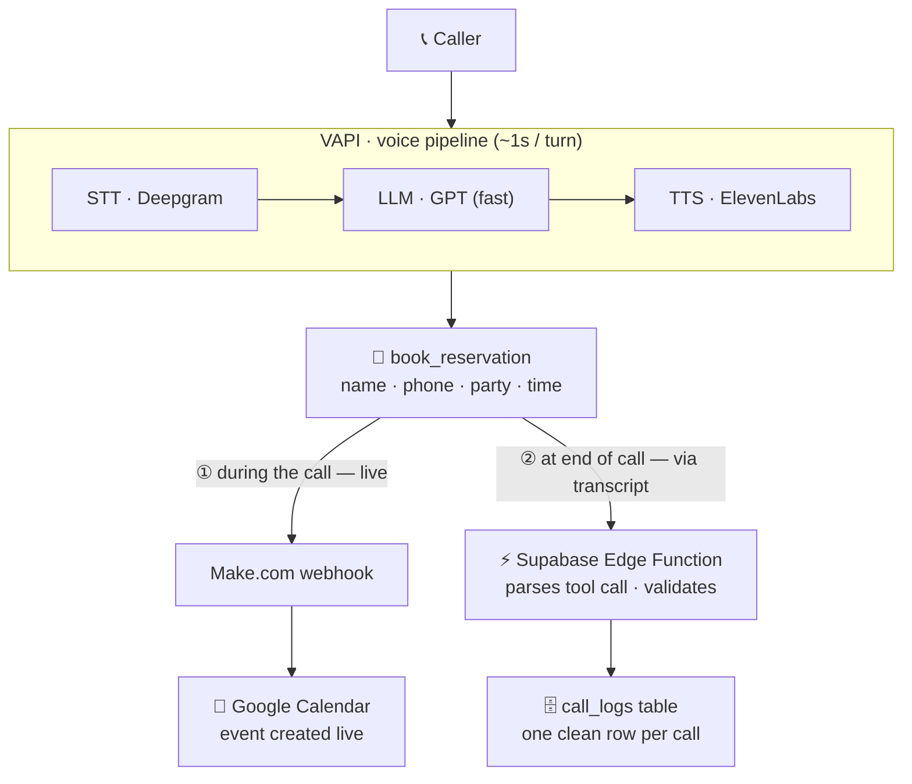

# Architecture — Restaurant Reservation Voice Agent

Voice booking that also logs every call. Built on VAPI, with the `book_reservation`
tool call feeding two paths: a **live** booking to Google Calendar, and an
**end-of-call** log to Supabase.

## How the data flows

The `book_reservation` tool call is the single source of truth. Its arguments
(`name`, `phone`, `partySize`, `startDateTime`) are used at **two moments**:

1. **During the call (live):** VAPI POSTs the arguments to a Make.com webhook,
   which creates the Google Calendar event in real time.
2. **At end of call:** VAPI sends an `end-of-call-report` webhook to a Supabase
   Edge Function. The report contains the full transcript **including** the
   book_reservation tool-call message. The function parses that tool call,
   validates/sanitizes it (field-swap fix, junk-name guard, phone normalize),
   and inserts one row into `call_logs`.

VAPI's async `analysis` is deliberately **not** used — it is empty at webhook
time, so the tool call embedded in the transcript is the reliable source.

## Data reliability (defense in depth)

| Layer | Where | Job |
|-------|-------|-----|
| Prevent | VAPI prompt + tool field descriptions | Capture correct values, no placeholders |
| Correct | Edge Function | Swap-fix, junk-name guard, phone normalize |
| Constrain | Supabase column types | `party_size` int rejects non-numbers |
| Ground truth | `transcript` column | Full conversation always stored |
